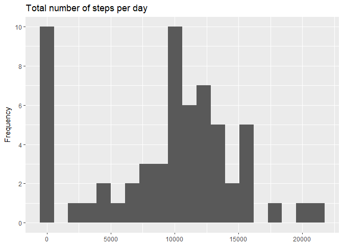
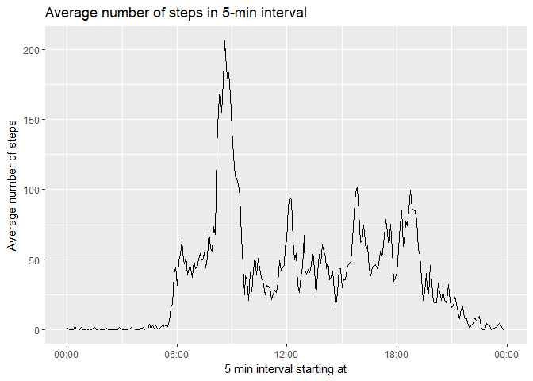
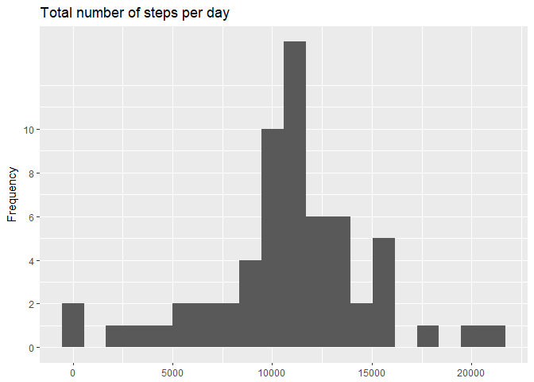
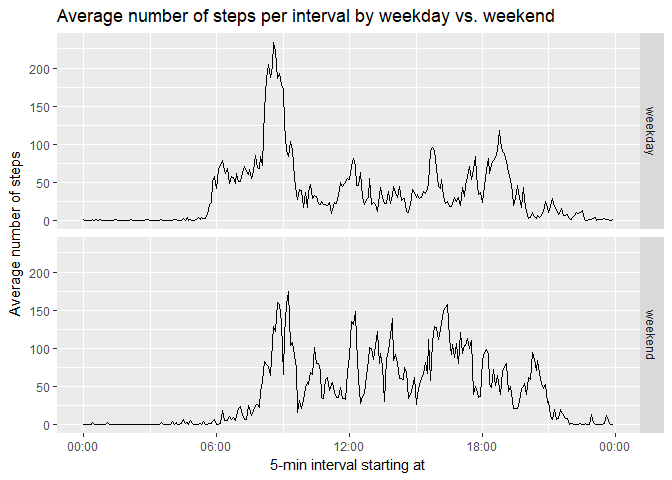

## Reproducible Research: Peer Assessment 1

### Q0: Loading and preprocessing the data

As a first step, the data is downloaded and then read into R:


```r
library(stringr)
```

```
## Warning: package 'stringr' was built under R version 3.4.4
```

```r
if(!file.exists('activity.csv')) {
  download.file('https://d396qusza40orc.cloudfront.net/repdata%2Fdata%2Factivity.zip',
                       dest = 'activity.zip', mode = 'wb')
  unzip('activity.zip')
}
datafr <- read.csv('activity.csv', stringsAsFactors=FALSE)

datafr$interval <- str_pad(datafr$interval, 4, pad = '0')
datafr$datetime <- strptime(datafr$interval, '%H%M')
```

### Q1: What is mean total number of steps taken per day?

In order to answer the question, the following code is used:


```r
library(ggplot2)

totalStepsPerDay <- tapply(datafr$steps, as.factor(datafr$date), function (x) sum(x, na.rm = TRUE))
meanStepsPerDay <- mean(totalStepsPerDay, na.rm = TRUE)
medianStepsPerDay <- median(totalStepsPerDay, na.rm = TRUE)
sprintf("The mean number of steps per day is %.2f.", meanStepsPerDay)
```

```
## [1] "The mean number of steps per day is 9354.23."
```

```r
sprintf("The median number of steps per day is %.2f.", medianStepsPerDay)
```

```
## [1] "The median number of steps per day is 10395.00."
```

```r
df_totalStepsPerDay <- data.frame(date = names(totalStepsPerDay), totalSteps = totalStepsPerDay)

ggplot(df_totalStepsPerDay, aes(totalSteps)) + geom_histogram(bins = 20, na.rm = TRUE) +
  scale_y_continuous(name = 'Frequency', breaks = seq(0, 10, length = 6)) +
  ggtitle('Total number of steps per day') + xlab(NULL)
```

<!-- -->

Please note:  
NA values were excluded from the calculation. This means, though, that if only NA values were available for a specific date, the total number of steps for the day becomes zero. This is reflected in the histogram which shows a number of days with zero steps.

### Q2: What is average daily activity pattern?

In order to answer the question, the following code is used:


```r
library(scales)

avgStepsPerInterval <- tapply(datafr$steps, as.character(datafr$datetime), function (x) mean(x, na.rm = TRUE))

df_avgStepsPerInterval <- data.frame(interval = as.character(names(avgStepsPerInterval)), avgSteps = avgStepsPerInterval)

maxInterval <- as.character(with(df_avgStepsPerInterval, interval[which.max(avgSteps)]))

sprintf("The interval with the highest average number of steps is the 5-min interval starting at %s.", substr(maxInterval, 12, nchar(maxInterval)))
```

```
## [1] "The interval with the highest average number of steps is the 5-min interval starting at 08:35:00."
```

```r
df_avgStepsPerInterval$interval = strptime(df_avgStepsPerInterval$interval, '%Y-%m-%d %H:%M:%S')

ggplot(df_avgStepsPerInterval, aes(interval, avgSteps, group = 1)) + geom_line() +
  ggtitle('Average number of steps in 5-min interval') + 
  xlab('5 min interval starting at') + ylab('Average number of steps') + 
  scale_x_datetime(labels = date_format('%H:%M', tz = 'Europe/Berlin'))
```

<!-- -->


### Q3: Imputing missing values

**Strategy to impute values:**  
Use mean value for each interval as the value for each mssing value.  

In order to answer the question, the following code is used:


```r
numNA <- sum(is.na(datafr))
sprintf("The total number of missing values in the dataset is %i.", numNA)
```

```
## [1] "The total number of missing values in the dataset is 2304."
```

```r
avgStepsPerInterval1 <- tapply(datafr$steps, as.character(datafr$interval), function (x) mean(x, na.rm = TRUE))

df_avgStepsPerInterval1 <- data.frame(interval = as.character(names(avgStepsPerInterval1)), avgSteps = avgStepsPerInterval1)

datafr1 <- merge.data.frame(datafr, df_avgStepsPerInterval1, by = 'interval')
valNA <- is.na(datafr1$steps)
datafr1$steps[valNA] <- datafr1$avgSteps[valNA]

totalStepsPerDay1 <- tapply(datafr1$steps, as.factor(datafr1$date), function (x) sum(x, na.rm = TRUE))

meanStepsPerDay1 <- mean(totalStepsPerDay1)
medianStepsPerDay1 <- median(totalStepsPerDay1)
sprintf("The mean number of steps per day is %.2f.", meanStepsPerDay1)
```

```
## [1] "The mean number of steps per day is 10766.19."
```

```r
sprintf("The median number of steps per day is %.2f.", medianStepsPerDay1)
```

```
## [1] "The median number of steps per day is 10766.19."
```

```r
df_totalStepsPerDay1<- data.frame(date = names(totalStepsPerDay1), totalSteps = totalStepsPerDay1)

ggplot(df_totalStepsPerDay1, aes(totalSteps)) + geom_histogram(bins = 20, na.rm = TRUE) +
  scale_y_continuous(name = 'Frequency', breaks = seq(0, 10, length = 6)) +
  ggtitle('Total number of steps per day') + xlab(NULL)
```

<!-- -->

In Q1, NA values were excluded from the calculation. This means, that if only NA values were available for a specific date, the total number of steps for the day becomes zero. In Q3, though, NAs were imputed so that the total number of steps becomes different from and higher than zero. This leads to a **higher mean** after values are imputed regardless of the method used for imputing the value (except for the one which sets all NA values to zero). The effect on the median seems more dependent on the method and the specifics of the dataset.  
Here, the NAs were replaced by the mean for the respective interval. For this method and dataset, the **median increased** as well and has the same value as the mean.  
That mean and median are identical in these circumstances is not a complete coincidence. As data for whole days was missing for some dates, these dates were filled with exactly the average. So there are some dates somewhere "around the middle" of the dataset with exactly the mean value and one of them is the median value.

### Q4: Are there differences in activity patterns between weekdays and weekends?

In order to answer the question, the following code is used:


```r
library(tidyr)
```

```
## Warning: package 'tidyr' was built under R version 3.4.4
```

```r
datafr$date <- as.Date(as.character(datafr$date))
datafr$weekdays <- weekdays(datafr$date)
weekenddays <- unique(datafr$weekdays)[6:7]
datafr$category <- ifelse(datafr$weekdays %in% weekenddays, "weekend", "weekday")

datafr$categoryInterval <- with(datafr, paste(category, interval, sep = '.'))

totalStepsPerCategoryInterval <- tapply(datafr$steps, datafr$categoryInterval, function (x) mean(x, na.rm = TRUE))

df_totalStepsPerCategoryInterval <- data.frame(categoryInterval = as.character(names(totalStepsPerCategoryInterval)), totalSteps = totalStepsPerCategoryInterval)

df_totalStepsPerCategoryInterval <- separate(data = df_totalStepsPerCategoryInterval, col = categoryInterval, into = c('category', 'interval'), sep ='\\.')

df_totalStepsPerCategoryInterval$totalSteps <- as.numeric(df_totalStepsPerCategoryInterval$totalSteps)

df_totalStepsPerCategoryInterval$interval <- str_pad(df_totalStepsPerCategoryInterval$interval, 4, pad = '0')
df_totalStepsPerCategoryInterval$datetime <- strptime(df_totalStepsPerCategoryInterval$interval, '%H%M')

ggplot(df_totalStepsPerCategoryInterval, aes(datetime, totalSteps, group = 1)) + geom_line() + 
  facet_grid(category~.) + 
  ggtitle('Average number of steps per interval by weekday vs. weekend') + 
  ylab('Average number of steps') + 
  scale_x_datetime(labels = date_format('%H:%M', tz = 'Europe/Berlin')) +
  xlab('5-min interval starting at')
```

<!-- -->

The plot shows that there is indeed a difference between weekdays and weekends: During weekdays, there is a very strong peak around 8.30am (most likely the time when most people are on their way to their daily occupations), which cannot be found on weekends. In contrast, the average number of steps is much more evenly distributed on weekends throughout the active hours of the day. These active hours also start a bit later on weekends compared to weekdays. 
