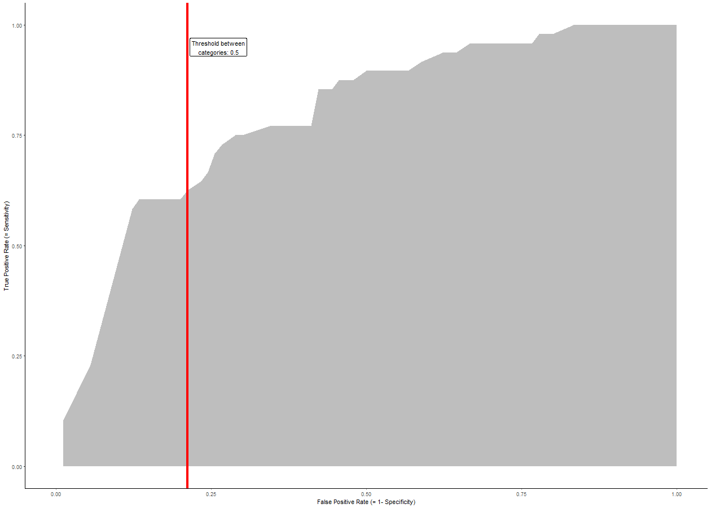

Visualizing ROC curves with Shiny: Towards a better intuitive understanding
========================================================
author: Christian Tellkamp
date: 2018/04/18
autosize: true

Motiviation
========================================================

Receiver Operating Characteristic (ROC) curves in combination with Area Under Curve (AUC) are a powerful tool to evaluate the performance of binary classification algorithms

However, the concept is not easy to grasp

- It is based on concepts such as **True Positive Rate (TPR)** and **False Positive Rate (FPR)** which in themselves are not easy to grasp
- The ROC curves is basically the **result of varies predictions** with different thresholds and not just the outcome of one prediction
- Furthermore, these **thresholds themselves do not directly appear in the ROC curve**
- There are **various factors that affect the ROC curve** (sample size, number of variables) which also do not appear directly in the outcome

An **interactive Shiny App** may help learners to get a better **intuitive understanding of the underlying concepts**


Dataset and algorithm for prediction
========================================================

The following points describe the dataset and algorithm for prediction:

- For the app an existing dataset is used, namely the **South African Hearth Disease Data** from the `SAheart` dataset available from `library(ElemStatLearn)`* as a basis for the Shiny app
- The dataset was split into **70% training and 30% test** set
- The independent variable to be predicted is the **diagnosis of coronary heart disease**
- The prediction is based on a simple **linear regression model** without interaction effects


Use of Shiny app
========================================================

The user can interact with the app in the following way:

- **Choose variables:**  
    Some variables used for the prediction are always present in the dataset, while others can be selected by the user via check boxes in the left panel
- **Select share of observations:**  
    With the help of the slider in the left panel, the user can also select what share of observations from the training set she wants to include
- **Define the threshold value for tradeoff between TPR and FPR:**  
    The user can also select the threshold value for the prediction cagegories, and a line corresponding to this threshold is then displayed in the graph
    

Code for generating the basic ROC chart
========================================================


```r
g <- ggplot(dfPlot, aes(fpr, tpr)) + 
        geom_ribbon(aes(ymin = 0, ymax = tpr), fill = 'gray') + 
        labs(
            x = 'False Positive Rate (= 1- Specificity)', 
            y = 'True Positive Rate (= Sensitivity)') + 
        coord_cartesian(xlim=c(0, 1)) +
        theme(axis.title.x = element_text(size=16), axis.title.y = element_text(size=16)) +
        geom_vline(xintercept = thresholdFpr,size = 1.5, color = 'red') +
        geom_label(x = thresholdFpr + 0.05, y = 1- 0.05, 
                       label = paste("Threshold between\ncategories:", threshold)) +
        theme_classic()
```


Basic ggplot chart
========================================================


