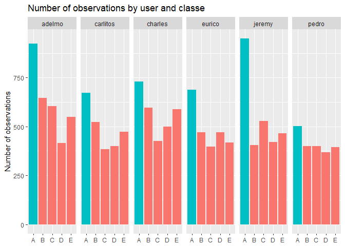

## Executive Summary

Fitness devices today can capture a lot of information on how much people exercise, but they do not yet capture how well certain exercises are performed. This may require additional sensors. This project analysis accelerometer date from weight lifting exercises and tries to identify how well these were performed. The analysis is based on a random forest model. The results suggest that it is indeed possible to predict how well these exercises were performed.  

## Research Question

The following analysis tries to answer the following question:

*Based on measurements from accelerometers during exercise, is it possible to identify how well an exercise was executed?*

The analysis is based on measurements on a number of individuals that performed a weight lifting exercises. More details on this can be found at http://groupware.les.inf.puc-rio.br/har.

## Data Preprocessing

As an initial step, the data for the project is downloaded from the Internet.


```r
url_training <- 'https://d396qusza40orc.cloudfront.net/predmachlearn/pml-training.csv'
url_testing <- 'https://d396qusza40orc.cloudfront.net/predmachlearn/pml-testing.csv'

if(!file.exists('pml-training.csv')) {
  download.file(url_training,'pml-training.csv')
}
if(!file.exists('pml-testing.csv')) {
  download.file(url_testing,'pml-testing.csv')
}

training = read.csv('pml-training.csv')
testing = read.csv('pml-testing.csv')
```

I then did some preprocessing on the data, specifically:

- Remove all columns with more thant 1% of missing data
- Remove all rows with missing values based on the remaining columns
- Eliminiate columns with running number, those related to date and time and windows which seem to have little relevance for the task
- Convert dependent variable (classe) into factor (in training set only as classe not given for test set)

Furthermore, I split the training set again in 80% for training and 20% for cross-validation.


```r
library(caret)

cols <- colSums(is.na(training)) < (0.01 / nrow(training)) & colSums(training == '') < (0.01 / nrow(training)) 

train <- training[, cols]
train <- na.omit(train)
train <- train[, -c(1, 3:7)]
train$classe <- as.factor(train$classe)

test <- testing[, cols]
test <- na.omit(test)
test <- test[, -c(1, 3:7)]

inTrain = createDataPartition(train$classe, p = 0.8, list = FALSE)
train = train[ inTrain,]
crossValidation = train[-inTrain,]
```

## Exploratory Data Analysis

After data preprocessing, the data set contains 53 independent variables remain and the one dependent variable that should be predicted. No rows were eliminated.  

Due to the large number of independent variables, it is difficult to perform a concise exploratory data analysis. I therefore focused on the dependent variable and the different users. The appendix contains a short overview of the data based on the `str()` function.


```r
library(ggplot2)

ggplot(train, aes(classe, fill = classe=='A')) + geom_bar() + facet_grid(.~user_name) + 
  labs(x=NULL, y = 'Number of observations', title = 'Number of observations by user and classe') +
  guides(fill=FALSE)
```

<!-- -->

The plot shows that classe A (which stands for the correct execution of the exercise) is the most common oberservation for all users while all other exercises are roughly equally frequent. It also shows that the number of observations per user can vary, but that for each user and classe al least 300 observations exist.

## Modelling 

As there is no obvious answer to the question which of the measurements are relevant for the prediction, I use a model which includes all of the measured 53 remaining independent variables. A random forest algorithm is used.  

In order to increase computing speed, parallel computing is used. Additionally, the resampling method was changed from the default of bootstrapping to k-fold cross-validation with k = 5. The impact of this change is to reduce the number of samples against which the random forest algorithm is run from 25 to 5, and to change each sample's composition from leave one out to randomly selected training folds. Details on this approach can be found at https://github.com/lgreski/datasciencectacontent/blob/master/markdown/pml-randomForestPerformance.md.


```r
library(parallel)
library(doParallel)

cluster <- makeCluster(detectCores() - 1) # convention to leave 1 core for OS
registerDoParallel(cluster)

fitControl <- trainControl(method = "cv",
                           number = 5,
                           allowParallel = TRUE)

model <- train(classe ~ ., method="rf",data = train,trControl = fitControl)

stopCluster(cluster)
registerDoSEQ()
```

The model is then used to predict the performance on the training and cross-validation set.


```r
predictTrain <- predict(model, train)
predictCrossValidation <- predict(model, crossValidation)

confusionMatrix(predictTrain, train$classe)
```

```
## Confusion Matrix and Statistics
## 
##           Reference
## Prediction    A    B    C    D    E
##          A 4464    0    0    0    0
##          B    0 3038    0    0    0
##          C    0    0 2738    0    0
##          D    0    0    0 2573    0
##          E    0    0    0    0 2886
## 
## Overall Statistics
##                                      
##                Accuracy : 1          
##                  95% CI : (0.9998, 1)
##     No Information Rate : 0.2843     
##     P-Value [Acc > NIR] : < 2.2e-16  
##                                      
##                   Kappa : 1          
##  Mcnemar's Test P-Value : NA         
## 
## Statistics by Class:
## 
##                      Class: A Class: B Class: C Class: D Class: E
## Sensitivity            1.0000   1.0000   1.0000   1.0000   1.0000
## Specificity            1.0000   1.0000   1.0000   1.0000   1.0000
## Pos Pred Value         1.0000   1.0000   1.0000   1.0000   1.0000
## Neg Pred Value         1.0000   1.0000   1.0000   1.0000   1.0000
## Prevalence             0.2843   0.1935   0.1744   0.1639   0.1838
## Detection Rate         0.2843   0.1935   0.1744   0.1639   0.1838
## Detection Prevalence   0.2843   0.1935   0.1744   0.1639   0.1838
## Balanced Accuracy      1.0000   1.0000   1.0000   1.0000   1.0000
```

```r
confusionMatrix(predictCrossValidation, crossValidation$classe)
```

```
## Confusion Matrix and Statistics
## 
##           Reference
## Prediction   A   B   C   D   E
##          A 893   0   0   0   0
##          B   0 614   0   0   0
##          C   0   0 543   0   0
##          D   0   0   0 512   0
##          E   0   0   0   0 585
## 
## Overall Statistics
##                                      
##                Accuracy : 1          
##                  95% CI : (0.9988, 1)
##     No Information Rate : 0.2838     
##     P-Value [Acc > NIR] : < 2.2e-16  
##                                      
##                   Kappa : 1          
##  Mcnemar's Test P-Value : NA         
## 
## Statistics by Class:
## 
##                      Class: A Class: B Class: C Class: D Class: E
## Sensitivity            1.0000   1.0000   1.0000   1.0000   1.0000
## Specificity            1.0000   1.0000   1.0000   1.0000   1.0000
## Pos Pred Value         1.0000   1.0000   1.0000   1.0000   1.0000
## Neg Pred Value         1.0000   1.0000   1.0000   1.0000   1.0000
## Prevalence             0.2838   0.1951   0.1725   0.1627   0.1859
## Detection Rate         0.2838   0.1951   0.1725   0.1627   0.1859
## Detection Prevalence   0.2838   0.1951   0.1725   0.1627   0.1859
## Balanced Accuracy      1.0000   1.0000   1.0000   1.0000   1.0000
```

```r
accuracyTrain <- confusionMatrix(predictTrain, train$classe)$overall[[1]]
accuracyCrossValidation <- confusionMatrix(predictCrossValidation, crossValidation$classe)$overall[[1]]
```

The model reaches an accuracy of `round(r accuracyTrain, 2)` on the training set and of 1 on the cross-validation set. The appendix contains details on the performance on the training and cross-validation set based on the function `confusionMatrix()` in r. 

The predictions for the test dataset are also contained in the appendix. The predictions were 100% accurate according to the Prediction Quiz.

## Conclusion

The results suggest that it is indeed possible to predict how well these exercises were performed. indeed is possible not only on the training, but also on the test dataset. 

## Appendix 


```r
str(train)
```

```
## 'data.frame':	15699 obs. of  54 variables:
##  $ user_name           : Factor w/ 6 levels "adelmo","carlitos",..: 2 2 2 2 2 2 2 2 2 2 ...
##  $ roll_belt           : num  1.41 1.41 1.48 1.48 1.45 1.42 1.43 1.45 1.43 1.42 ...
##  $ pitch_belt          : num  8.07 8.07 8.05 8.07 8.06 8.13 8.16 8.18 8.18 8.2 ...
##  $ yaw_belt            : num  -94.4 -94.4 -94.4 -94.4 -94.4 -94.4 -94.4 -94.4 -94.4 -94.4 ...
##  $ total_accel_belt    : int  3 3 3 3 3 3 3 3 3 3 ...
##  $ gyros_belt_x        : num  0 0.02 0.02 0.02 0.02 0.02 0.02 0.03 0.02 0.02 ...
##  $ gyros_belt_y        : num  0 0 0 0.02 0 0 0 0 0 0 ...
##  $ gyros_belt_z        : num  -0.02 -0.02 -0.03 -0.02 -0.02 -0.02 -0.02 -0.02 -0.02 0 ...
##  $ accel_belt_x        : int  -21 -22 -22 -21 -21 -22 -20 -21 -22 -22 ...
##  $ accel_belt_y        : int  4 4 3 2 4 4 2 2 2 4 ...
##  $ accel_belt_z        : int  22 22 21 24 21 21 24 23 23 21 ...
##  $ magnet_belt_x       : int  -3 -7 -6 -6 0 -2 1 -5 -2 -3 ...
##  $ magnet_belt_y       : int  599 608 604 600 603 603 602 596 602 606 ...
##  $ magnet_belt_z       : int  -313 -311 -310 -302 -312 -313 -312 -317 -319 -309 ...
##  $ roll_arm            : num  -128 -128 -128 -128 -128 -128 -128 -128 -128 -128 ...
##  $ pitch_arm           : num  22.5 22.5 22.1 22.1 22 21.8 21.7 21.5 21.5 21.4 ...
##  $ yaw_arm             : num  -161 -161 -161 -161 -161 -161 -161 -161 -161 -161 ...
##  $ total_accel_arm     : int  34 34 34 34 34 34 34 34 34 34 ...
##  $ gyros_arm_x         : num  0 0.02 0.02 0 0.02 0.02 0.02 0.02 0.02 0.02 ...
##  $ gyros_arm_y         : num  0 -0.02 -0.03 -0.03 -0.03 -0.02 -0.03 -0.03 -0.03 -0.02 ...
##  $ gyros_arm_z         : num  -0.02 -0.02 0.02 0 0 0 -0.02 0 0 -0.02 ...
##  $ accel_arm_x         : int  -288 -290 -289 -289 -289 -289 -288 -290 -288 -287 ...
##  $ accel_arm_y         : int  109 110 111 111 111 111 109 110 111 111 ...
##  $ accel_arm_z         : int  -123 -125 -123 -123 -122 -124 -122 -123 -123 -124 ...
##  $ magnet_arm_x        : int  -368 -369 -372 -374 -369 -372 -369 -366 -363 -372 ...
##  $ magnet_arm_y        : int  337 337 344 337 342 338 341 339 343 338 ...
##  $ magnet_arm_z        : int  516 513 512 506 513 510 518 509 520 509 ...
##  $ roll_dumbbell       : num  13.1 13.1 13.4 13.4 13.4 ...
##  $ pitch_dumbbell      : num  -70.5 -70.6 -70.4 -70.4 -70.8 ...
##  $ yaw_dumbbell        : num  -84.9 -84.7 -84.9 -84.9 -84.5 ...
##  $ total_accel_dumbbell: int  37 37 37 37 37 37 37 37 37 37 ...
##  $ gyros_dumbbell_x    : num  0 0 0 0 0 0 0 0 0 0 ...
##  $ gyros_dumbbell_y    : num  -0.02 -0.02 -0.02 -0.02 -0.02 -0.02 -0.02 -0.02 -0.02 -0.02 ...
##  $ gyros_dumbbell_z    : num  0 0 -0.02 0 0 0 0 0 0 -0.02 ...
##  $ accel_dumbbell_x    : int  -234 -233 -232 -233 -234 -234 -232 -233 -233 -234 ...
##  $ accel_dumbbell_y    : int  47 47 48 48 48 46 47 47 47 48 ...
##  $ accel_dumbbell_z    : int  -271 -269 -269 -270 -269 -272 -269 -269 -270 -269 ...
##  $ magnet_dumbbell_x   : int  -559 -555 -552 -554 -558 -555 -549 -564 -554 -552 ...
##  $ magnet_dumbbell_y   : int  293 296 303 292 294 300 292 299 291 302 ...
##  $ magnet_dumbbell_z   : num  -65 -64 -60 -68 -66 -74 -65 -64 -65 -69 ...
##  $ roll_forearm        : num  28.4 28.3 28.1 28 27.9 27.8 27.7 27.6 27.5 27.2 ...
##  $ pitch_forearm       : num  -63.9 -63.9 -63.9 -63.9 -63.9 -63.8 -63.8 -63.8 -63.8 -63.9 ...
##  $ yaw_forearm         : num  -153 -153 -152 -152 -152 -152 -152 -152 -152 -151 ...
##  $ total_accel_forearm : int  36 36 36 36 36 36 36 36 36 36 ...
##  $ gyros_forearm_x     : num  0.03 0.02 0.02 0.02 0.02 0.02 0.03 0.02 0.02 0 ...
##  $ gyros_forearm_y     : num  0 0 -0.02 0 -0.02 -0.02 0 -0.02 0.02 0 ...
##  $ gyros_forearm_z     : num  -0.02 -0.02 0 -0.02 -0.03 0 -0.02 -0.02 -0.03 -0.03 ...
##  $ accel_forearm_x     : int  192 192 189 189 193 193 193 193 191 193 ...
##  $ accel_forearm_y     : int  203 203 206 206 203 205 204 205 203 205 ...
##  $ accel_forearm_z     : int  -215 -216 -214 -214 -215 -213 -214 -214 -215 -215 ...
##  $ magnet_forearm_x    : int  -17 -18 -16 -17 -9 -9 -16 -17 -11 -15 ...
##  $ magnet_forearm_y    : num  654 661 658 655 660 660 653 657 657 655 ...
##  $ magnet_forearm_z    : num  476 473 469 473 478 474 476 465 478 472 ...
##  $ classe              : Factor w/ 5 levels "A","B","C","D",..: 1 1 1 1 1 1 1 1 1 1 ...
```


```r
confusionMatrix(predictTrain, train$classe)
```

```
## Confusion Matrix and Statistics
## 
##           Reference
## Prediction    A    B    C    D    E
##          A 4464    0    0    0    0
##          B    0 3038    0    0    0
##          C    0    0 2738    0    0
##          D    0    0    0 2573    0
##          E    0    0    0    0 2886
## 
## Overall Statistics
##                                      
##                Accuracy : 1          
##                  95% CI : (0.9998, 1)
##     No Information Rate : 0.2843     
##     P-Value [Acc > NIR] : < 2.2e-16  
##                                      
##                   Kappa : 1          
##  Mcnemar's Test P-Value : NA         
## 
## Statistics by Class:
## 
##                      Class: A Class: B Class: C Class: D Class: E
## Sensitivity            1.0000   1.0000   1.0000   1.0000   1.0000
## Specificity            1.0000   1.0000   1.0000   1.0000   1.0000
## Pos Pred Value         1.0000   1.0000   1.0000   1.0000   1.0000
## Neg Pred Value         1.0000   1.0000   1.0000   1.0000   1.0000
## Prevalence             0.2843   0.1935   0.1744   0.1639   0.1838
## Detection Rate         0.2843   0.1935   0.1744   0.1639   0.1838
## Detection Prevalence   0.2843   0.1935   0.1744   0.1639   0.1838
## Balanced Accuracy      1.0000   1.0000   1.0000   1.0000   1.0000
```

```r
confusionMatrix(predictCrossValidation, crossValidation$classe)
```

```
## Confusion Matrix and Statistics
## 
##           Reference
## Prediction   A   B   C   D   E
##          A 893   0   0   0   0
##          B   0 614   0   0   0
##          C   0   0 543   0   0
##          D   0   0   0 512   0
##          E   0   0   0   0 585
## 
## Overall Statistics
##                                      
##                Accuracy : 1          
##                  95% CI : (0.9988, 1)
##     No Information Rate : 0.2838     
##     P-Value [Acc > NIR] : < 2.2e-16  
##                                      
##                   Kappa : 1          
##  Mcnemar's Test P-Value : NA         
## 
## Statistics by Class:
## 
##                      Class: A Class: B Class: C Class: D Class: E
## Sensitivity            1.0000   1.0000   1.0000   1.0000   1.0000
## Specificity            1.0000   1.0000   1.0000   1.0000   1.0000
## Pos Pred Value         1.0000   1.0000   1.0000   1.0000   1.0000
## Neg Pred Value         1.0000   1.0000   1.0000   1.0000   1.0000
## Prevalence             0.2838   0.1951   0.1725   0.1627   0.1859
## Detection Rate         0.2838   0.1951   0.1725   0.1627   0.1859
## Detection Prevalence   0.2838   0.1951   0.1725   0.1627   0.1859
## Balanced Accuracy      1.0000   1.0000   1.0000   1.0000   1.0000
```


```r
predictTest <- predict(model, test)
data.frame(case = 1:length(predictTest), prediction = predictTest)
```

```
##    case prediction
## 1     1          B
## 2     2          A
## 3     3          B
## 4     4          A
## 5     5          A
## 6     6          E
## 7     7          D
## 8     8          B
## 9     9          A
## 10   10          A
## 11   11          B
## 12   12          C
## 13   13          B
## 14   14          A
## 15   15          E
## 16   16          E
## 17   17          A
## 18   18          B
## 19   19          B
## 20   20          B
```
